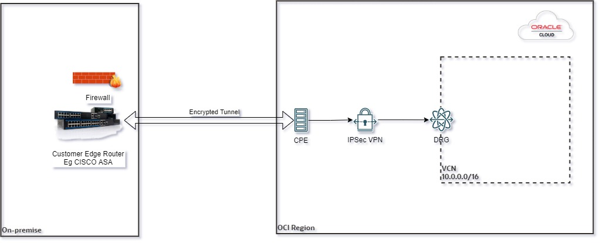

# OCI IPSec VPN setup Stack
OCI Resource manager stack for IPsec VPN deployment.

## Project description

The stack help you to provision an IPsec VPN with all advanced options available.

## Topology Diagram 

Here is a reference architecture diagram for the below deployment

## Functionality of the Stack

Two Modes:

_Deploy IPSec VPN with new resources_ 
**Create New Network (Virtual Cloud Network) as well as new DRG (Dynamic Routing Gateway)**

_Deploy IPSec VPN with existing resource in the tenancy_  
**You can use existing VCN (Virtual Cloud Network) and DRG (Dynamic Routing Gateway)**

## How to use code ?

### Deploy Using Oracle Resource Manager

1. Click 

    If you aren't already signed in, when prompted, enter the tenancy and user credentials.Cancel changes

2. Review and accept the terms and conditions.

3. Select the region where you want to deploy the stack.

4. Follow the on-screen prompts and instructions to create the stack. Supply the required values

5. After creating the stack, click **Plan** button.

6. Wait for the job to be completed, and review the plan.

    To make any changes, return to the Stack Details page, click **Edit Stack**, and make the required changes. Then, run the **Plan** action again. (It's a best practive always plan and verify the action before **apply**)

7. If no further changes are necessary, return to the Stack Details page, click **Apply**. 

### OCI Resource Manager Stack Output

Once the job finsihed sucessfully you will receive the **Public IP and Pre-shared-Key** for both the tunnels as an ouput. You van see the same from the logs as well as from the **Output** tab

### I hope the VPN stack helps you :) Thank you !!!

